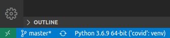

# Covid-19 Data 

Dependencies:
* Python 3

## Set up

### Python Virual Environment

Create and activate a virtual environment to prevent python and dependency collisions.

**Create**
`python3 -m venv {ENV_NAME}` 

**Activate**:
`source {ENV_NAME}/bin/activate`

### Install dependencies

`pip install -r requirements.txt`

### Running Jupyter Notebook

**VSCode**:
1. Install Python Extension

2. Select Virtual Environment
  

3. Open Jupyter Notebook (*.ipynb)

**Jupyter Notebook**

Run: `jupyter notebook`

1. Activate Virtual Environment
2. Navigate to: `localhost:8888`
3. Open Jupyter Notebook (*.ipynb)